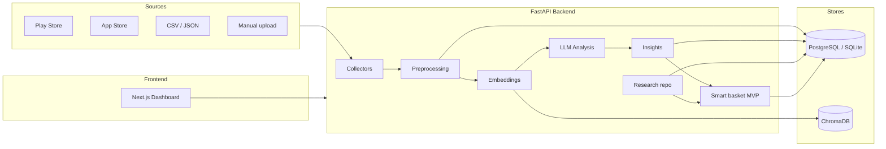

# Architecture

**Project:** AI-Powered Product Discovery Engine for Blinkit  
**Phase:** 6a — MVP recommendation engine; deployment and dashboard in progress.

## System overview



## Phase 1 deliverables

| Layer | Status in Phase 1 |
|-------|-------------------|
| Config & logging | Implemented |
| Relational schema (all tables) | Implemented via Alembic |
| Health endpoint | DB + vector path + Groq config check |
| Collectors / ingestion | Phase 2 — implemented |
| Preprocessing & embeddings | Phase 3 — implemented |
| Research repository | Phase 5 — interviews, surveys, triangulation, opportunities |
| MVP recommendation engine | Phase 6a — adjacency, barriers, insight-linked copy |
| MVP HTTP + eval harness | Phase 6b — `/api/mvp/*`, held-out basket metrics |
| Dashboard + Streamlit + CI | Phase 6c — Next.js panels, Case 1 app, GitHub Actions |
| Frontend | Dashboard shell |

## Data pipeline (planned)

1. **Review ingestion** — collector per source, raw payload persisted, `runs` tracking
2. **Preprocessing** — clean, dedupe, language, translate
3. **Embedding pipeline** — sentence-transformers → ChromaDB
4. **LLM analysis** — Groq via `LLMClient`, versioned prompts
5. **Clustering & themes** — UMAP + HDBSCAN, theme taxonomy
6. **Insight generator** — confidence scoring, cross-source validation
7. **Research repository** — interview/survey ingest, affinity map, triangulation, opportunity scoring
8. **MVP expansion** — barrier-aware adjacent SKU suggestions citing insight IDs

## Backend layout

```
backend/app/
  main.py           # FastAPI app, middleware, routes
  config.py         # Settings
  db/               # engine, session, base
  models/           # SQLAlchemy ORM
  api/routes/       # HTTP routers (health in Phase 1)
  core/             # logging, errors
  collectors/       # Phase 2+
  llm/              # Phase 4+
  ...
```

## Deployment (target)

- **Case 2:** Next.js on Vercel, FastAPI on Railway/Render, Postgres + vectors on Supabase
- **Case 1:** Streamlit all-in-one (later phase)

## Security

- Secrets via environment variables only
- No PII in public repo (survey names pseudonymized before publish)
- Rate limiting and cost ceilings on LLM runs (Phase 4+)

## Failure recovery

- Idempotent preprocessing and analysis runs keyed by version fields
- Failed rows quarantined, batch continues
- Health endpoint for orchestration and deploy probes
