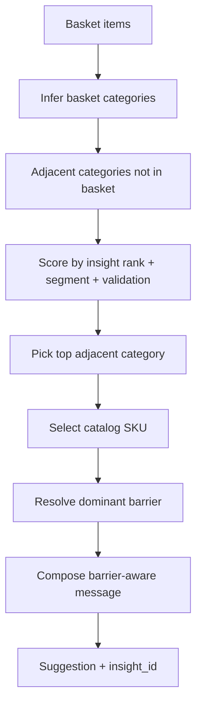

# MVP Design — AI Smart Basket Expansion

**Project:** AI-Powered Product Discovery Engine for Blinkit  
**Phase:** 6 — Smart Basket Expansion (6a engine, 6b API + eval)  
**Selected from:** Phase 5 opportunity ranking + [`problem-definition.md`](./problem-definition.md)

---

## MVP choice

**AI Smart Basket Expansion** — at checkout, suggest **one** adjacent-category SKU with plain-language copy grounded in a **validated insight ID** and the shopper’s **dominant discovery barrier**.

| Criterion | Rationale |
|-----------|-----------|
| North star | Adds an adjacent category without extra browse time |
| Evidence | Interviews show mission-driven search + trust barriers; surveys show appetite when explanations exist |
| Effort | Rule-based adjacency + insight-linked copy; no production reco model swap |
| Deployability | Stateless API over existing SQLite insight store |

Rejected for MVP driver copy: insights marked `rejected` in triangulation (e.g. delivery-as-discovery-root-cause).

---

## User story

> As a **repeat grocery shopper**, when my cart has milk, bread, and snacks, I want **one relevant non-grocery suggestion** (e.g. pet treats) with **why it fits**, so I can try a new category without browsing the full catalog.

---

## Inputs and outputs

### Request (logical)

| Field | Description |
|-------|-------------|
| `basket_items` | List of `{ name, category? }` — category optional; inferred from catalog keywords |
| `customer_segment` | e.g. `mission_shopper`, `explorer`, `family_stockup` — filters insight affinity |
| `limit` | Default `1` (one item per order); demo may use `3` |

### Response (per suggestion)

| Field | Description |
|-------|-------------|
| `product_id`, `product_name`, `category` | Suggested SKU |
| `adjacent_to` | Basket category that triggered the adjacency edge |
| `insight_id` | Cited insight row (required) |
| `dominant_barrier` | `awareness` \| `trust` \| `price` \| `search` \| `quality_doubt` \| `habit` |
| `message` | Barrier-aware reason string |
| `validation_status` | From linked insight (prefer `validated`, `partially_supported`) |

---

## Recommendation logic

1. **Category inference** — keyword map from Blinkit-style catalog (`backend/app/mvp/catalog.py`).
2. **Adjacency** — static cross-category graph (grocery ↔ pet, baby, personal care, etc.).
3. **Insight binding** — prefer insights whose problem/opportunity mentions the target category or “adjacent” / “discovery”; boost validated rows; match segment when present.
4. **Fallback insight** — top-ranked non-rejected insight with `example_review_ids` if no category match.

---

## Barrier-aware messaging

Dominant barrier is resolved per `(customer_segment, target_category)` from:

1. Interview `coding_json.discovery_barriers` for matching segment  
2. Affinity map barrier counts for the theme  
3. Default `trust` for non-grocery expansions, `habit` for grocery-only baskets  

| Barrier | Copy leads with |
|---------|-----------------|
| **trust** | Star rating, return policy, “shoppers like you” |
| **awareness** | Use case / occasion (“complete your pet’s weekly treat”) |
| **price** | Value frame (“under ₹199”, “often bought with your staples”) |
| **search** | Discoverability (“easy to find next to snacks”) |
| **quality_doubt** | Reviews and brand assurance |
| **habit** | Complement frame (“pairs with what’s already in your cart”) |

Messages never cite review IDs in user copy; `insight_id` is the audit trail for PMs and demo evaluators.

---

## Phase 6b — API and evaluation (implemented)

| Method | Path | Purpose |
|--------|------|---------|
| GET | `/api/mvp/status` | Insight/opportunity counts, eval set size, `ready` flag |
| GET | `/api/mvp/catalog` | Demo SKU list for dashboard / Streamlit |
| POST | `/api/mvp/recommend` | Basket + segment → suggestions with `insight_id` |
| GET | `/api/mvp/eval-baskets` | Held-out baskets (labels withheld) |
| POST | `/api/mvp/evaluate` | Run harness; records `runs.phase=mvp_eval` |

**Evaluation metrics (held-out set in `backend/data/mvp_eval_baskets.json`):**

- **Category hit** — top suggestion category matches expected adjacent set  
- **Insight cited** — `insight_id` resolves in DB  
- **Non-rejected insight** — triangulation status not `rejected` / `contradicting`  
- **Pass** — all of the above plus non-empty message  

---

## Out of scope (Phase 6d+)

- Full Lighthouse 90+ pass and Framer Motion polish (incremental)  
- Production deploy execution (documented in deployment-plan)  

---

## Acceptance (Phase 6c)

- Dashboard loads live data from `NEXT_PUBLIC_API_URL`; MVP tab runs recommend + eval.  
- Streamlit Case 1 app mirrors MVP + overview against the same API.  
- `docs/deployment-plan.md`, `docs/edge-cases.md`, manual checklist present.  
- GitHub Actions runs backend tests and frontend build on push/PR.  

---

## Acceptance (Phase 6b)

- `POST /api/mvp/recommend` returns 503 when no insights exist; 200 with cited suggestion when seeded.  
- `POST /api/mvp/evaluate` returns aggregate pass rate and per-case breakdown on held-out baskets.  
- Eval labels are not exposed on `/api/mvp/eval-baskets`.  

---

## Acceptance (Phase 6a)

- Given a grocery-only basket and segment, engine returns ≥1 suggestion with non-empty `message` and integer `insight_id`.
- Changing dominant barrier changes message template family (trust vs awareness).
- Rejected-only insight pool still returns a suggestion using the best available non-rejected insight.
- Unit tests cover adjacency, barrier resolution, and insight linkage without Groq.
