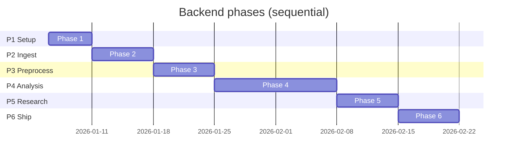
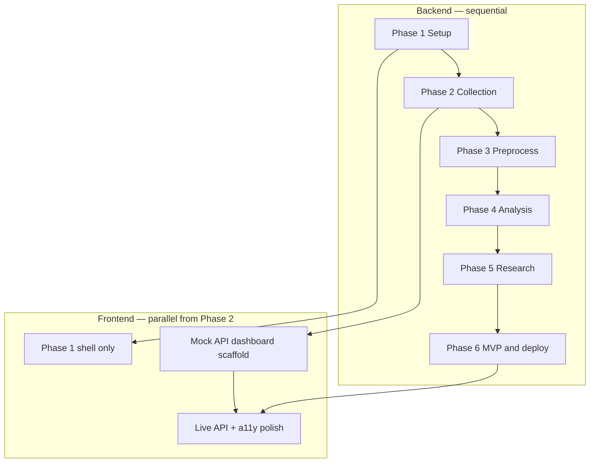

# Sequencing and Effort

Companion to [implementation-plan.md](./implementation-plan.md) §8. Defines **build order**, **schedule budget**, **parallel work**, and **phase gates** before starting the next phase.

---

## Policy

| Rule | Detail |
|------|--------|
| Backend / pipeline | Phases **1 → 6** are **strictly sequential**. Do not start phase *N+1* until phase *N* acceptance criteria pass. |
| Frontend | Dashboard scaffolding may run **in parallel from Phase 2** using mocked or partial APIs. Full wiring and polish land in **Phase 6**. |
| Documentation | **Docs first** for each phase (see table below). Update the listed `docs/` files before merging feature code. |
| Gates | Automated checks via `GET /api/project/phases` and `python scripts/check_phase_gates.py`. Manual criteria stay in the checklist at the bottom. |

---

## Relative effort (100% backend + product total)

Assumes a **~120 hour** graduation timeline unless you set `PROJECT_EFFORT_HOURS` in the environment.

| Phase | Focus | Effort | ~Hours @ 120h |
|-------|--------|--------|----------------|
| 1 | Project setup | 10% | 12 |
| 2 | Review collection | 15% | 18 |
| 3 | Preprocessing and embeddings | 15% | 18 |
| 4 | LLM analysis and insights | 30% | 36 |
| 5 | Research and validation | 15% | 18 |
| 6 | MVP, deployment, testing | 15% | 18 |

Phase **4** is intentionally **double** phase 2 or 3 — it is the analytical core (LLM, clustering, insights, prompts).

### Suggested calendar (single builder, sequential backend)



Adjust dates to your cohort; **ratios** (10 / 15 / 15 / 30 / 15 / 15) stay fixed.

### Parallel frontend track



---

## Documentation order (docs-first)

| Phase | Update before coding |
|-------|----------------------|
| 1 | `context.md`, `architecture.md`, `implementation-plan.md` |
| 2 | `workflow.md` |
| 3 | `review-analysis.md` (cleaning) |
| 4 | `review-analysis.md` (analysis, prompts) |
| 5 | `research-plan.md`, `interview-guide.md`, `survey-plan.md`, `problem-definition.md` |
| 6 | `mvp-design.md`, `deployment-plan.md`, `edge-cases.md`, `testing-strategy.md` |

---

## Phase gates

**Automated** gates run in CI-friendly mode (`check_phase_gates.py --through 6`). **Manual** gates require human verification (live scrapers, Lighthouse, deploy URL, blind insight review).

| Phase | Automated (examples) | Manual (from implementation plan) |
|-------|----------------------|-----------------------------------|
| 1 | DB health, core tables, key docs, `docker-compose.yml` | No secrets in repo; Next.js shell renders |
| 2 | Sample CSV, collectors, ingest routes | ≥1k live store reviews; dedupe on re-ingest |
| 3 | Preprocess pipeline, cleaning/dedupe modules | 10k reviews &lt;5 min; duplicate rate spot-check |
| 4 | Versioned prompts, insights API, golden set | 1k analyze &lt;2% fail; 8–20 themes; 15 insights; blind review |
| 5 | Research docs, triangulation code, ≥5 interviews in DB | Rejection example; top-3 opportunity rationale |
| 6 | MVP + CI + Streamlit + testing docs | Public deploy demo; Lighthouse ≥90; rollback demo |

### Commands

```bash
# Summary JSON (same shape as API)
cd backend
python scripts/check_phase_gates.py

# Fail CI if a phase through N is incomplete
python scripts/check_phase_gates.py --through 6 --fail-on-incomplete

# API
curl http://127.0.0.1:8000/api/project/phases
curl http://127.0.0.1:8000/api/project/sequencing
```

Set **`PROJECT_EFFORT_HOURS`** (default `120`) to rescale hour estimates in API responses.

---

## When to stop and fix

Do **not** advance if:

- Automated gates for the current phase are red (`passed: false`).
- A manual gate for the current phase is unchecked in your runbook.
- Phase 4 prompt golden-set agreement drops below the floor in [testing-strategy.md](./testing-strategy.md).

---

## Related

- Acceptance detail: [implementation-plan.md](./implementation-plan.md) §5  
- Tests: [testing-strategy.md](./testing-strategy.md)  
- Manual QA: [manual-testing-checklist.md](./manual-testing-checklist.md)
