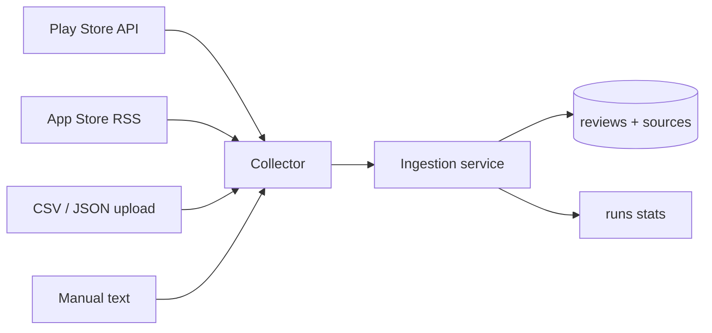

# Review ingestion workflow

## Overview

Reviews enter the system through **collectors** (Play Store, App Store, CSV, JSON, manual). Each ingestion creates a **`runs`** record and persists **`reviews`** with full **`raw_payload`** before any preprocessing (Phase 3).



## Blinkit source identifiers

| Store | App | Identifier |
|-------|-----|------------|
| Google Play | Blinkit: Grocery in 10 minutes | `com.grofers.customerapp` |
| Apple App Store (IN) | Blinkit: Groceries & More | `960335206` |

## API endpoints

| Method | Path | Description |
|--------|------|-------------|
| `POST` | `/api/reviews/ingest/play-store` | Scrape Play Store reviews |
| `POST` | `/api/reviews/ingest/app-store` | Fetch App Store RSS reviews |
| `POST` | `/api/reviews/upload` | Upload CSV or JSON file |
| `POST` | `/api/reviews/manual` | Paste one or more review texts |
| `GET` | `/api/reviews/stats` | Counts by source |
| `GET` | `/api/runs` | Recent ingestion runs |

## Deduplication

Unique key: `(source_id, external_id)`. If `external_id` is missing, a stable hash of review text is used.

Re-running the same ingestion **skips** existing rows and reports counts in `runs.stats_json`.

## CSV format

Required column (any of): `text`, `review`, `body`, `content`

Optional: `external_id`, `rating`, `posted_at`, `author`

Custom mapping can be passed as query JSON on upload.

## JSON format

Array of objects with the same field names as CSV rows.

## Sample offline data

`backend/data/sample_blinkit_reviews.csv` — demo corpus (~500 rows) for offline development.

Generate or refresh:

```bash
cd backend
python scripts/fetch_sample_reviews.py
```

## Adding a new source

1. Implement `BaseCollector` in `app/collectors/<name>.py`
2. Register in `app/collectors/registry.py`
3. Add route or reuse CSV/JSON upload
